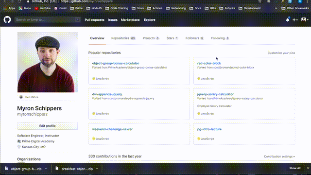
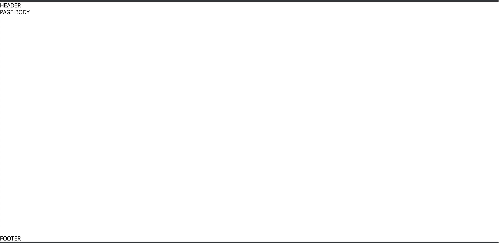
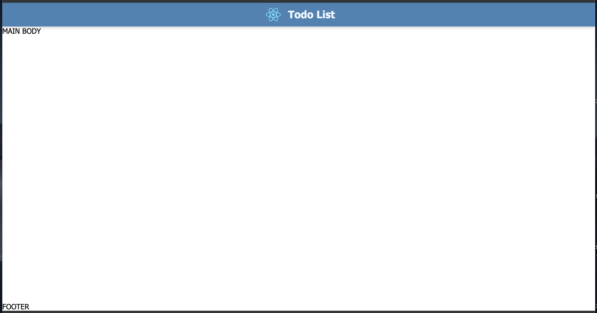

# Todo List React Tutorial

This tutorial will teach ReactJS by building a Todo List. We will start by building the Front-End and then build on top of it little by little demonstrating Back-End and database technologies along the way. We will be building the Todo List from the ground up leveraging `create-react-app` for our Front-End bundling system.

## Getting Started

**Technologies**

* [`create-react-app`](https://github.com/facebook/create-react-app)
* [`redux`](https://redux.js.org/)
* [`react-router-dom`](https://www.npmjs.com/package/react-router-dom)

### Setup Bundler and Initialize Repository

Open your terminal and navigate to the directory where you want your application to live.

**run (in terminal):**

```
npx create-react-app todo-list-app
```

This line of code will create a directory called `todo-list-app` inside the directory you navigated to. Not only did it create the application directory for you but if you look inside the directory you'll notice it has also scaffolded the initial application code you will need.

```
todo-list-app
├── README.md
├── node_modules
├── package.json
├── .gitignore
├── public
│   ├── favicon.ico
│   ├── index.html
│   └── manifest.json
└── src
    ├── App.css
    ├── App.js
    ├── App.test.js
    ├── index.css
    ├── index.js
    ├── logo.svg
    └── serviceWorker.js
```

Navigate into the the `todo-list-app` application directory from the terminal.

**run (in terminal):**

```
cd todo-list-app
```

There are some dependencies that we are going to need to add. From the terminal now that we are in the `todo-list-app` directory we'll use `npm` to install the necessary dependencies by running the following command.

**run (in terminal):**

```
npm install --save redux react-router-dom 
```

This one command installs `redux` and `react-router-dom` as dependencies in our project. The `README.md` in your `todo-list-app` application directory has details on all of the scripts available for running the build but we're going to take a look at just one of them for now. Go ahead and run the following command from your terminal in the `todo-list-app` directory.

**run (in terminal):**

```
npm start
```

When this is down building the Front-End files it will automagically launch a new tab in your web browser serve up a local version of the site. The start command has integrated into it a watch so when you save changes to your code it will run a live refresh of the webpage. At this point you could start developing anything you want.

SWEET!!!

Let's go ahead and setup your the repository now. From your terminal while still in the `todo-list-app` directory run the following.

**run (in terminal):**

```
git init
```

Open the `todo-list-app` in your favorite editor. I personally recommend VS Code in case you're looking for a recommendation. We're going to be adding some lines of code to the `.gitignore` file. Add the following to the file under the `# dependencies` section. We already have a lot of different things listed in there so we only need to add the one extra thing.

**add to `.gitignore`:**

```
/package-lock.json
```

With this addition we simply need to commit the initial state of our code. From the terminal run the following.

**run (in terminal):**

```
git add .
git commit -m "initial application codebase"
```

With this we have a local repository instantiated on our machine but we need to get it up on GitHub. Open your browser and navigate to you GitHub page. In the top right corner you will see a "+" icon. Go ahead and click on the plus. In the dropdown select **New repository**. In the **Repository name** field enter in "todo-list-app" then scroll to the bottom of the page and click on the green **Create repository** button.



GitHub will create the repository for you and then all we need to do is git our local repository pushed up to this new remote repository. We'll do this by running these two lines of code in our terminal.

**run (in terminal):**

```
git remote add origin https://github.com/myronschippers/todo-list-app.git
```

**then run:**

```
git push -u origin master
```

We're not going to worry about branching strategies with this tutorial but if you want to use a branching strategy please feel free. For the rest of us will just be working on the `master` branch.

### Restructuring the Base Application Code

With the code up and running I am going to walk you through some structure updates because I like to work in a little different of a structure for my projects in order to keep things organized. After that I am going to change the components from functional components to class based components so that we can focus on a more Object Oriented Programming approach. I know know functional components are the new hotness but just bare with me. First let's move some files around. 

Create a new director called `components` inside of the `src` directory.

```
todo-list-app
└── src
    └── components
```

Inside of the `components` directory create another directory called `App`.

```
todo-list-app
└── src
    └── components
        └── App
```

Move `./src/App.js`, `./src/App.css`, `./src/App.test.js`, and `./src/logo.svg` into `./src/components/App`. Our directory structure should look something like this:

```
todo-list-app
├── README.md
├── node_modules
├── package.json
├── .gitignore
├── public
│   ├── favicon.ico
│   ├── index.html
│   └── manifest.json
└── src
    ├── components
    │   └── App
    │       ├── App.css
    │       ├── App.js
    │       ├── App.test.js
    │       └── logo.svg
    ├── index.css
    ├── index.js
    └── serviceWorker.js
```

Your browser would have refreshed after you made those changes and if we take a look we'll likely see some errors because we have to update the file paths.

Open up `./src/index.js`.

**Change:**

```JS
import App from './App';
```

**to be:**

```JS
import App from './components/App/App';
```

If you look back at the browser again everything should be working just fine. This is something that is setup in the `create-react-app` build where it will surface any JS error or React errors directly in your browser window. This will help us debug errors as we come across them.

Open up `./src/components/App/App.js` so we can convert it to being a class based component instead of a functional component.

**Change:**

```JS
import React from 'react';
```

**to be:**

```JS
import React, { Component } from 'react';
```

**AND**

**Change:**

```JS
function App() {
    return (
        <div className="App">
            <header className="App-header">
                
                <p>
                    Edit <code>src/App.js</code> and save to reload.
                </p>
                <a
                className="App-link"
                href="https://reactjs.org"
                target="_blank"
                rel="noopener noreferrer"
                >
                    Learn React
                </a>
            </header>
        </div>
    );
}
```

**to be:**

```JS
class App extends Component {
    render() {
        return (
            <div className="App">
                <header className="App-header">
                    
                    <p>
                        Edit <code>src/App.js</code> and save to reload.
                    </p>
                    <a
                    className="App-link"
                    href="https://reactjs.org"
                    target="_blank"
                    rel="noopener noreferrer"
                    >
                        Learn React
                    </a>
                </header>
            </div>
        );
    }
}
```

From here we're ready to start getting into the actual application and write some of our own components.

# Todo List, Front-End Application

This application is going to be a todo list but it's gonna have some very specific requirements that will change based on new feature requests that come in. As we add more features to our application the complexity will get greater and we'll add new technologies to support that need. Right now we are looking to create an application with a Header, Footer, and Daily Todo List. The concept is that this is a page the user can keep open on their device (computer, tablet, or phone) and check off items as they complete them. We don't really care about making the data persist at this time. 

**Application Requirements:**

1. Header
    * Application bar with the name of the application, "Todo List", and logo
    * Content should be centered
1. Footer
    * Content "© Todo Lit 2019"
1. Daily Todo List
    * Feature:
        * List Title
        * Add Todo to List
        * List of Todos
1. Add Todo to List (feature)
    * `<input>` for Name of Todo
    * `<input>` for Description of Todo
    * "Add Todo" button that will trigger the action of adding the information entered by the user to the list
1. List of Todos (feature)
    * Displays a series of todos in order of item entered with the first item entered displayed at the top of the list
    * Todos will not be displayed side by side but stacked one on top of the other.
1. Todo Item (feature)
    * User should be able to delete a Todo
    * A Todo should be able to be marked as complete
    * Display the name and description of the todo with the name having more visual importance

If you want to see a working version of this application you can checkout the [Sample Todo List Application](https://github.com/myronschippers/todo-list-app). It's branch structure is outlined in the `README.md` for that repo. At a high level just be aware that there is a branch for every phase that changes that state of that repo to what it would be at the end of that particular phase and the naming convention is branch `feature-phase-1-1` for **Phase 1.1**.

## Phase 1: Scaffolding our Application

In **Phase 1** we will complete all of the requirements we have been given including the setup of the master layout elements, creating a daily todo list rendered to the DOM, and a way to add items to our daily todo list. We'll start things out by putting together the overall master layout for the Todo List application.

**Major Topics:** 
* Component Creation
* Passing Data to Components via Props
* Working with JSX
* Directory composition

### Phase 1.1: Setting Up Master Layout

In **Phase 1.1** we'll create the master layout that will established the major structure for our application. It will give us an opportunity to talk a little bit more about what JSX is because `create-react-app` sets up our build to accept JSX in our React Javascript code.

Every master layout consists of the same three things a Header, Footer, and Main Body content areas. This configuration may change a little bit from project to project 90% of the time this is the core of our master layout. In some case you need navigation but our application doesn't require a navigation so that's not something we have to worry about.

**Sample Repo Branch:**

* [Todo after Phase 1.1](https://github.com/myronschippers/todo-list-app/tree/feature-phase-1-1)

### Phase 1.1: Setting Up Master Layout

**Editing (files):**

* `App.js` - located at `./src/components/App/App.js`
* `App.css` - located at `./src/components/App/App.css`
* `index.css` - located at `./src/index.css`
* `index.html` - located at `./public/index.html`

We are going to use something called [JSX](https://reactjs.org/docs/introducing-jsx.html) to help us write some HTML elements in our Javascript. JSX is a syntax extension to Javascript and it produces React "element". You can think of it as a way to write HTML in our Javascript. It is extremely handy when using React.

**Example JSX:**

```JSX
const element = <h1>Hello, world!</h1>;
```

Open up `./src/components/App/App.js` so we can begin to flesh out our application elements. Lets start by removing all of the existing markup except the outer most `<div>` and then I can highlight some of what is going on here.

```JS
import React, { Component } from 'react';
import logo from './logo.svg';
import './App.css';

class App extends Component {
    render() {
        return (
            <div className="scaffold">
            </div>
        );
    }
}

export default App;
```

A React Component is created with `class App extends Component` and every class based React Component `extends` the React base Component class to allow access to all of the special React things. Every React component class also must have a `render()` method. The build system will actually throw an error if you do not have one as well as a `return` inside of your `render()` method. Whatever is being returned is what will render as part of your view. All of your JSX normally goes in the `return` but it doesn't have to. You may have cases where you need to conditionally render something and might use the JSX just before the `return` still in the `render()` method.

Another difference you will notice in JSX is the addition of something called `className` it may seem like there is some magic going on there like with our `<div className="scaffold">` but this is just an element attribute representing the `class` attribute we are used to seeing. If you want to add a class(es) to an element you'll need to use the `className` attribute instead.

```JS
class App extends Component {
    render() {
        return (
            <div className="scaffold">
                STUFF
            </div>
        );
    }
}
```

**Outputs HTML:**

```HTML
<div class="scaffold">
    STUFF
</div>
```

I am going to supply you with the HTML markup and styling so that we can expedite the process of setting up the initial content. This initial markup is going to be just an initial layout. Once the mark up is in place we'll begin to look at how we "Componentize" the application and what that means.

First we'll need to add a class to our `index.html` file. This class is specifically for the CSS layout architecture.

**Change from:**

```HTML
<div id="root"></div>
```

**to be:**

```HTML
<div id="root" class="scaffoldPrimer"></div>
```

We have removed the content that `create-react-app` stubs in for us and put in it's place a `<div>` with the content of **STUFF** but now we need to add in those three major master layout areas to our `App.js` JSX content. All we're doing is setting up an HTML structure where we have places for the Header, Footer, and the Main Body content for our application. Eventually the `App.js` component will become our master template.

**In `App.js`:**

```JS
class App extends Component {
    render() {
        return (
            <div className="scaffold">
                <div className="scaffold-hd">
                    HEADER
                </div>
                <div className="scaffold-bd">
                    MAIN BODY
                </div>
                <div className="scaffold-ft">
                    FOOTER
                </div>
            </div>
        );
    }
}
```

With the markup / JSX in place to give our master layout structure, let's add the styling. Starting out in the `./src/index.css` replace all of the existing styles with the following.

```CSS
html,
body {
	height: 100%;
	padding: 0;
	margin: 0;
}

body {
	font-family: 'Open Sans', 'Segoe UI', Tahoma, Geneva, Arial, sans-serif;
}
```

These styles are specifically getting added to the `index.css` because they are base level element styles. Our next set of styling will be replacing all of the styles in `App.css`.

```CSS
/* ----------------------------------------------------------------------
Scaffold Primer
---------------------------------------------------------------------- */

.scaffoldPrimer {
    height: 100%;
    width: 100%;
    padding: 0;
    margin: 0;
}

/* ----------------------------------------------------------------------
Scaffold
---------------------------------------------------------------------- */

.scaffold {
	display: flex;
	height: 100%; /* needed for IE10 */
	min-height: 100%;
	flex-direction: column;
}

.scaffold-hd {
	flex: 0 0 auto;
}

.scaffold-bd {
	flex: 1 0 auto;
}

```

These styles are module specific styling that force the footer content to the bottom of our browser window even if the Main Body content of the page isn't enough content to push the footer to the bottom of the page. If you take a look at the browser where the application is currently loaded up you should see this styling in action. At this point the application should look something like this.

---

[Code Sample](https://github.com/myronschippers/todo-list-app/tree/feature-phase-1-1)


### Phase 1.2: Header Markup and Styling

In **Phase 1.2** we're gonna update our application page content by creating the header content that will include a logo and name of the application. This concept of all of this content at the top of the page within a solid color block is referred to as an **App Bar** in most design/web shops.

**Sample Repo Branch:**

* [Todo after Phase 1.2](https://github.com/myronschippers/todo-list-app/tree/feature-phase-1-2)

**Editing (files):**

* `App.js` - located at `./src/components/App/App.js`
* `App.css` - located at `./src/components/App/App.css`

One of the things we'll leverage from the React content that `create-react-app` stubbed in for us is the React Logo SVG. We left the logo import at the to of the `App.js` where it says `import logo from './logo.svg';`. When the logo is imported we store it in the `logo` variable so we can use it in our JSX later on. 

```JS
import React, { Component } from 'react';
import logo from './logo.svg';
import './App.css';
```

In the below code snippet we see the entire App component code but all we're updating is the JSX for the markup displayed to the user in place of the `HEADER` text we hand in there as a placeholder before. This new content starts with the `<header className="appBar">` element.

```JS
class App extends Component {
    render() {
        return (
            <div className="scaffold">
                <div className="scaffold-hd">
                    <header className="appBar">
                        <div className="appBar-identity">
                            
                            <h1 className="primeHdg">Todo List</h1>
                        </div>
                    </header>
                </div>
                <div className="scaffold-bd">
                    MAIN BODY
                </div>
                <div className="scaffold-ft">
                    FOOTER
                </div>
            </div>
        );
    }
}
```

Let's take a look at some of what is going on in our JSX code. Take particular notice of the `` tag inside of `<div className="appBar-identity">`. For our `src` attribute you'll notice that we are using curly brackets after the `=` instead of quotes like in our standard HTML. We open up curly brackets (`src={}`) any time we want to insert Javascript into our JSX. This is a generalization but it's a good way to think about it. In this particular scenario it's the `logo` that we have imported with Javascript that we want to ser as the `src={log}` for our logo.

The other thing you may have noticed is that we aren't using a `class` attribute on our elements but are instead using an attribute of `className`. In JSX if we want to add a class for styling an element we have to use `<div className="style-class">`.

If we had stored a set of class names in a variable:

*example code not part of application:*

```JS
render() {
    const largeBtn = 'btn btn_big';

    return (
```

we could use that variable for the value of the class name:

*example code not part of application:*
```JS
render() {
    const largeBtn = 'btn btn_big';

    return (
        <div className={largeBtn}>
```

This approach becomes particularly helpful when we need to conditionally alter the classes being used on our elements.

All of our markup is in place but let's add some styling to the bottom of `App.css` in order to make our header content look a little more like an application.

```CSS
/* ----------------------------------------------------------------------
App Bar
---------------------------------------------------------------------- */

.appBar {
    display: flex;
    flex-flow: row wrap;
    justify-content: center;
    align-items: center;
    box-sizing: border-box;
    width: 100%;
    padding: 0 20px 0;
    background: #4682B4;
    box-shadow: 0px 2px 6px rgb(0, 0, 0, 0.2);
    position: relative;
    z-index: 800;
}

.appBar-identity {
    padding: 6px 0;
    color: #f0f8ff;
}

.appBar-actions {
    padding: 0;
}

/* ----------------------------------------------------------------------
Primary Heading (app bar content)
---------------------------------------------------------------------- */

.primeHdg {
    display: inline-block;
    margin: 0;
    padding: 0 4px;
    font-size: 1.4rem;
    vertical-align: middle;
}

/* ----------------------------------------------------------------------
Logo Icon (app bar content)
---------------------------------------------------------------------- */

.logoIcon {
    display: inline-block;
    width: 3.5rem;
    vertical-align: middle;
}

```

Let's check our browser again to make sure there are no errors and that our styles are showing up correctly for our new header content. It should look something like this.

---

[Code Sample](https://github.com/myronschippers/todo-list-app/tree/feature-phase-1-2)



### Phase 1.3: Footer Content and Styling

In **Phase 1.3** we're gonna update our application page content by creating footer content that will simply be a copyright statement that says, "© Todo List 2019". Our layout styling is already taking care of forcing our footer content to the bottom of the page but we'll also add some decorative styles to give the footer visual presence.

**Sample Repo Branch:**

* [Todo after Phase 1.3](https://github.com/myronschippers/todo-list-app/tree/feature-phase-1-3)

**Editing (files):**

* `App.js` - located at `./src/components/App/App.js`
* `App.css` - located at `./src/components/App/App.css`

Here is the JSX changes we'll need to make to replace the "FOOTER" text placeholder we currently have for the footer content. Please be aware that you will see `{/* ... HEADER JSX CODE (see Phase 1.2) ... */}` in the below code and that that is just to help consolidate the code we are looking at. We want to focus on the footer content for **Phase 1.3**.

*in `App.js`:*

```JS
class App extends Component {
    render() {
        return (
            <div className="scaffold">
                <div className="scaffold-hd">
                    {/* ... HEADER JSX CODE (see Phase 1.2) ... */}
                </div>
                <div className="scaffold-bd">
                    PAGE BODY
                </div>
                <div className="scaffold-ft">
                    <footer className="appBase">
                        &copy; Todo List 2019
                    </footer>
                </div>
            </div>
        );
    }
}
```

We aren't using any new JSX or React feature for the footer content so let's go ahead and update our `App.css` by adding the footer styling to the bottom of the stylesheet.

*in `App.css`:*

```CSS
/* ----------------------------------------------------------------------
App Base
---------------------------------------------------------------------- */

.appBase {
    display: block;
    box-sizing: border-box;
    width: 100%;
    padding: 15px 20px 20px;
    background: #f8f8ff;
    font-size: 0.8rem;
    text-align: center;

    position: relative;
}

.appBase:before {
    content: " ";
    width: 70%;
    height: 1px;
    border-radius: 1px;
    background: #c0c0c0;

    /* CSS Centering */
    position: absolute;
    left: 50%;
    top: 0;
    transform: translate(-50%, 0);
}

```

That's not a lot of content but if we look out our application in the browser that styling we implemented helps to give the footer content more visual presence.

---

[Code Sample](https://github.com/myronschippers/todo-list-app/tree/feature-phase-1-3)


### Phase 1.4: Componentizing Header and Footer Content

In **Phase 1.4** we'll be looking at a new term **Componentize** and what that means. Putting it into practice I will show you how to componentize the Header content and then you'll try componentizing the footer content on your own.

**Sample Repo Branch:**

* [Todo after Phase 1.4](https://github.com/myronschippers/todo-list-app/tree/feature-phase-1-4)

**Editing (files):**

* `App.js` - `./src/components/App/App.js`
* `App.css` - `./src/components/App/App.css`

**Adding (files):**

* `Header.js` - `./src/components/Header/Header.js`
* `Header.css` - `./src/components/Header/Header.css`

What is Componentizing? React as a framework is a component based framework. This means that it is built on this idea that everything is a component and that each one of those components is a self contained entity with it's own *local state* (more on this later). Because they are self contained blocks of code we can create it once and then reuse it all over the place. Later we'll even see how we can pass data down to components through *props* to make them unique even though we are reusing a single component.

When we start componentizing something we have to make a new Javascript component file. Create a file called `Header.js` in a new `./src/components/Header` directory.

Inside of `Header.js` let's stub in the basic things needed for every React component.

*in `Header.js`:*

```JS
import React, { Component } from 'react';

class Header extends Component {
    render() {
        return (
            <div>
                CONTENT
            </div>
        );
    }
}

export default Header;
```

If we break this down we see some thing that are the same as the `App.js` component. Most importantly we are importing React and Component at the top of our file. This `React, { Component }` is providing us a short hand for `Component` when we use it to create our component class. We could jus as easily have our import be `import React from 'react'` and then our class definition would look like this `class Header extends React.Component {` so this is just a code styling choice and how you will see me setup all of the components in this tutorial.

When defining the the React class we are using Javascript ES6 to extend our `Header` class from React's `Component` class. This is how we get access to all of React's component functionality and without extending from the `Component` class we would just have a basic Javascript class.

The next two things that you will see on every React class based component is a `render()` method and a `return` in the `render()`. React will throw an error if these things are not in place and your React will not build so make sure they're there. If you have worked with Javascript before (and I hope you have) you will also notice that the `return` has `();` after it. This is a React/JSX thing that defines the area in which your outputted render markup can go, in our case this is JSX. 

The last thing to be aware of for every component is that you must have a single element wrapping all of your content in the return. In the below *example 1* code there are two sibling elements without an element wrapping them and this code will not build throwing an error at you. Below *example 2* is the correct way of writing it with a single element wrapping all of the content.

*example 1 (not valid):*

```JS
render() {
    return (
        <div>
            CONTENT
        </div>
        <div>
            MORE CONTENT
        </div>
    );
}
```

*example 2 (valid):*

```JS
render() {
    return (
        <div>
            <div>
                CONTENT
            </div>
            <div>
                MORE CONTENT
            </div>
        </div>
    );
}
```

With these React and JSX features in mind let's remove our header content from `App.js` and put it into our new `Header.js` component.

```js
class Header extends Component {
    render() {
        return (
            <header className="appBar">
                <div className="appBar-identity">
                    
                    <h1 className="primeHdg">Todo List</h1>
                </div>
            </header>
        );
    }
}
```

If your IDE is on top of things it should be yelling at you (red underline) about `logo`. Remember the place we imported logo to was `App.js` so we're going to have to move the SVG to `./src/components/Header` and import it into `Header.js`.

```JS
import React, { Component } from 'react';
import logo from './logo.svg';

class Header extends Component {
```

This next step is optional but I would do it in order to separate concerns. We can extract the styling that is specific to our header and make a new stylesheet that we will import into our `Header.js` component.

*create `Header.css` file in `./src/components/Header` directory:*

```CSS
/* ----------------------------------------------------------------------
App Bar
---------------------------------------------------------------------- */

.appBar {
    display: flex;
    flex-flow: row wrap;
    justify-content: center;
    align-items: center;
    box-sizing: border-box;
    width: 100%;
    padding: 0 20px 0;
    background: #4682B4;
    box-shadow: 0px 2px 6px rgb(0, 0, 0, 0.2);
    position: relative;
    z-index: 800;
}

.appBar-identity {
    padding: 6px 0;
    color: #f0f8ff;
}

.appBar-actions {
    padding: 0;
}

/* ----------------------------------------------------------------------
Primary Heading (app bar content)
---------------------------------------------------------------------- */

.primeHdg {
    display: inline-block;
    margin: 0;
    padding: 0 4px;
    font-size: 1.4rem;
    vertical-align: middle;
}

/* ----------------------------------------------------------------------
Logo Icon (app bar content)
---------------------------------------------------------------------- */

.logoIcon {
    display: inline-block;
    width: 3.5rem;
    vertical-align: middle;
}

```

*import new `Header.css`:*

```JS
import React, { Component } from 'react';
import logo from './logo.svg';
import './Header.css';

class Header extends Component {
```

Finally let's add our new component to `App.js` we will first need to import the component and then add the component element to our JSX. You will see the implementation of bot in the below code snippet.

```JS
import React, { Component } from 'react';
import './App.css';

// COMPONENTS
import Header from '../Header/Header';

class App extends Component {
    render() {
        return (
            <div className="scaffold">
                <div className="scaffold-hd">
                    <Header />
                </div>
                <div className="scaffold-bd">
                    MAIN BODY
                </div>
                <div className="scaffold-ft">
                    <footer className="appBase">
                        &copy; Todo List 2019
                    </footer>
                </div>
            </div>
        );
    }
}

export default App;
```

We have a fully componentized header. Go ahead and try componentizing the footer on your own and if you run into trouble take a look at the [Sample Code](https://github.com/myronschippers/todo-list-app/tree/feature-phase-1-4) for **Phase 1.4**.

---

[Code Sample](https://github.com/myronschippers/todo-list-app/tree/feature-phase-1-4)


### Phase 1.5: Rendering a List

In **Phase 1.5** we're gonna take a look at a very common pattern for rendering a list in React. Along with the component structure used to render the list we'll be taking a look at React's local state and how it works. It's common practice to create a series of 2 separate React components in order to render a list. The first component is for the list itself with the second component being a child component that is meant to handle the rendering and local state of the individual items in the list.

**Sample Repo Branch:**

* [Todo after Phase 1.5](https://github.com/myronschippers/todo-list-app/tree/feature-phase-1-5)

**Editing (files):**

* `App.js` - `./src/components/App/App.js`

**Adding (files):**

* `TodoList.js` - `./src/components/TodoList/TodoList.js`
* `TodoListItem.js` - `./src/components/TodoListItem/TodoListItem.js`

We could always try building out the functionality of the Todo List first and then decide how to componentize but as mentioned before there is a very common pattern used when rendering lists with React components. Let's go ahead and create a new file for our Todo List.

*create `./src/components/TodoList/TodoList.js` file:*

```JS
import React, { Component } from 'react';

class TodoList extends Component {
    render() {
        return (
            <div>
                TODO LIST
            </div>
        );
    }
}

export default TodoList;
```

We're gonna import the new `TodoList.js` into our `App.js` and create a static array as sample data to represent our list of todos. The array will be created not using the React state initially because I want to demonstrate how React's rendering works a little bit.

```JS
// COMPONENTS
import Header from '../Header/Header';
import Footer from '../Footer/Footer';
import TodoList from '../TodoList/TodoList';

const sampleList = [
    'Mail Letter',
    'Wash Dishes',
    'Cut Grass',
];

class App extends Component {
    // ...
```

In the above code snippet we imported the `TodoList.js` and made our sample data array. Take note that the array is just a simple array of strings for now while we run this test. It will become an array of objects in its final form. The below code snippet has a few updates. An event handler method of `clickAddToList` was added to the `App` class. Then in the body area we are printing out the array to the page with `{JSON.stringify(sampleList)}`. React will not render out objects or arrays directly to the page so we are leveraging `JSON.stringify` in order to make it into a string. Just below the array string we are adding a `<button>` and attaching the event handler to the click event listener for the `<button>` by leveraging the `onClick` event listener that React provides for us.

```JS
class App extends Component {
    clickAddToList(event) {
        sampleList.push('Pick Up Dinner');
        console.log(sampleList);
    }

    render() {
        return (
            <div className="scaffold">
                <div className="scaffold-hd">
                    <Header />
                </div>
                <div className="scaffold-bd">
                    {JSON.stringify(sampleList)}
                    <button onClick={this.clickAddToList}>Add Sample</button>
                    <TodoList />
                </div>
                <div className="scaffold-ft">
                    <Footer />
                </div>
            </div>
        );
    }
}
```

Give it a shot. Move over to your browser where the application is running and open up the browser's console. Try clicking on the button in your browser. You should notice that the array printing out in the console is getting updated but the one rendered to the page is not updating. This is because regardless of what updates are going on in the Javascript React doesn't re-render unless there is an update to React's state. Let's change the code around a little to have the `sampleList` stored on the `App` component's local state.

Local state in a React component has to be an object with whatever properties we want to add to it. React components look at a property on the class called `state` in order to maintain local state. There are two different methods in which we can add the state property. We can leverage the class constructor or add the property directly to the class.

*defining state method 1:*

```JS
class App extends Component {
    constructor(props) {
        super(props);

        this.state = {
            sampleLis: [],
        };
    }
```

*defining state method 2:*

```JS
class App extends Component {
    state = {
        sampleLis: [],
    };
```

We'll leverage method 2 for defining our state.

```JS
class App extends Component {
    state = {
        sampleList: [
            'Mail Letter',
            'Wash Dishes',
            'Cut Grass',
        ],
    }

    clickAddToList(event) {
        this.state.sampleList.push('Pick Up Dinner');
        console.log(this.state.sampleList);
    }

    render() {
        return (
            <div className="scaffold">
                <div className="scaffold-hd">
                    <Header />
                </div>
                <div className="scaffold-bd">
                    {JSON.stringify(this.state.sampleList)}
                    <button onClick={this.clickAddToList}>Add Sample</button>
                    <TodoList />
                </div>
                <div className="scaffold-ft">
                    <Footer />
                </div>
            </div>
        );
    }
}
```

If you were to test the application in your browser you would notice an error as soon as you clicked the button. This is because our event handler method is not bound to the scope of our `App` class. To correct this we need to bind the `clickAddToList` to the scope of our `App` class luckily ES6 gave us arrow function and we can leverage that to correct our scoping issue.

```JS
class App extends Component {
    state = {
        sampleList: [
            'Mail Letter',
            'Wash Dishes',
            'Cut Grass',
        ],
    }

    clickAddToList = (event) => {
        this.state.sampleList.push('Pick Up Dinner');
        console.log(this.state.sampleList);
    }
```

If we test our application again after this update we won't get an error when we click the button but our DOM is still not getting re-render. We can't alter the state directly, instead we need to leverage a class method that React provides us called `setState()`. We pass a new object to `setState()` with the updated properties we want.

*alter `clickAddToList` to use `setState()`:*

```JS
clickAddToList = (event) => {
    const newSampleList = this.state.sampleList;
    newSampleList.push('Pick Up Dinner');
    this.setState({
        sampleList: newSampleList,
    })
    console.log(this.state.sampleList);
}
```

Now if you test out the application in your browser you'll notice that the DOM render is now being updated as we push items into the array. This is the power of local state and what we use in order to re-render our React DOM when there has been a change.

How do we get the `sampleList` state over to our new `TodoList.js` component without physically moving the state in the code? React provides a way for us to do this with something called `props`. Passing the data to `<TodoList />` is as simple as creating an attribute on the component element.

```JS
    ...
</div>
<div className="scaffold-bd">
    <TodoList list={this.state.sampleList} />
</div>
<div className="scaffold-ft">
    ...
```

We access the data we pass using the `props` property on our `TodoList` class.

```JS
class TodoList extends Component {
    render() {
        return (
            <div>
                {JSON.stringify(this.props.list)}
            </div>
        );
    }
}
```

This is great we can see the list rendering through our `TodoList` component in the browser now. Let's update our `sampleList` to be more complex data that we can leverage to render actual todo items in our list.

*in `App.js`:*

```JS
class App extends Component {
    state = {
        sampleList: [
            {
                name: 'Mail Letter',
                description: 'A sample description of our todo.',
                isComplete: false,
            },
            {
                name: 'Wash Dishes',
                description: 'A sample description of our todo.',
                isComplete: true,
            },
            {
                name: 'Cut Grass',
                description: 'A sample description of our todo.',
                isComplete: false,
            },
        ],
    }
```

To start let's simply render an unordered list of all the names from the new list. 

```JS
class TodoList extends Component {
    render() {
        const listItems = this.props.list.map((item, index) => {
            return <li>{item.name}</li>
        });

        return (
            <div>
                <ul>
                    {listItems}
                </ul>
            </div>
        );
    }
}
```

If you look at this in the browser make sure to open up the console. There should be an error in the console that says, `Warning: Each child in a list should have a unique "key" prop.`. Any time we are creating a list of elements to be rendered in the JSX we need to add a unique `key` attribute to the element. For this the `index` of the item in the array is awfully handy.

```JS
class TodoList extends Component {
    render() {
        const listItems = this.props.list.map((item, index) => {
            return <li key={index}>{item.name}</li>
        });
```

We could potentially create the more complex markup right here in the `TodoList.js` component but we're going to create a new component that represents the list item. This is a very common pattern that you will see in React because this allows each individual item to have it's own local state.

*create `TodoItem.js` at `./src/components/TodoItem`:*

```JS
import React, { Component } from 'react';

class TodoItem extends Component {
    render() {
        const {
            todo,
        } = this.props;

        return (
            <li>
                <div>
                    <div>
                        <input
                            type="checkbox"
                            name="complete"
                            checked={todo.isComplete}
                        />
                    </div>
                    <div>
                        <h4>{todo.name}</h4>
                        <p>{todo.description}</p>
                    </div>
                    <div>
                        <button>Delete</button>
                    </div>
                </div> 
            </li>
        );
    }
}

export default TodoItem;
```

*replace the `<li>` with our `<TodoIem />` in `App.js`:*

```JS
import React, { Component } from 'react';
import TodoItem from '../TodoItem/TodoItem';

class TodoList extends Component {
    render() {
        const listItems = this.props.list.map((item, index) => {
            return <TodoItem key={index} todo={item} />
        });
```

If you check the updates to the application in the browser we can see that React is surfacing an error in the browser's console. This is a good time to talk about the change event listener that React gives us. All form fields have the ability to add a change event listener to them. This will allow us to track when a user makes a change to a form field. The implementation is like the `<button onClick={this.clickAddToList}>` we saw earlier while testing React's render and re-render. The change event listener uses the `onChange` attribute to assign an event handler. While we're at it though we might as well add the click event handler to our **Delete** button as well.

```JS
class TodoItem extends Component {
    changeCompleteStatus = (event) => {
        // update item complete status
    }

    clickDelete = (event) => {
        // delete the todo item
    }

    render() {
        const {
            todo,
        } = this.props;

        return (
            <li>
                <div>
                    <div>
                        <input
                            type="checkbox"
                            name="complete"
                            checked={todo.isComplete}
                            onChange={this.changeCompleteStatus}
                        />
                    </div>
                    <div>
                        <h4>{todo.name}</h4>
                        <p>{todo.description}</p>
                    </div>
                    <div>
                        <button
                            onClick={this.clickDelete}
                        >
                            Delete
                        </button>
                    </div>
                </div> 
            </li>
        );
    }
}
```

We have a problem though. How do we edit the data in the list if the state is being held in `App.js`? For this we'll leverage `props` but instead of passing data down we'll pass a couple of callbacks down for deleting and updating the list data.

*create the delete and complete functions in `App.js`:*

```JS
deleteTodoFromList = (index) => {
    let newSampleList = this.state.sampleList;
    newSampleList.splice(index, 1);

    this.setState({
        sampleList: newSampleList,
    });
}

completeTodo = (isComplete, index) => {
    let newSampleList = this.state.sampleList;
    newSampleList[index].isComplete = isComplete;

    this.setState({
        sampleList: newSampleList,
    })
}
```

*pass these new callback methods to `<TodoList />` in `App.js`:*

```JS
render() {
    return (
        <div className="scaffold">
            <div className="scaffold-hd">
                <Header />
            </div>
            <div className="scaffold-bd">
                <TodoList
                    list={this.state.sampleList}
                    completeCallback={this.completeTodo}
                    deleteCallback={this.deleteTodoFromList}
                />
            </div>
            <div className="scaffold-ft">
                <Footer />
            </div>
        </div>
    );
}
```

*pass the callbacks to `<TodoItem />` from `TodoList.js`:*

```JS
class TodoList extends Component {
    render() {
        const listItems = this.props.list.map((item, index) => {
            return <TodoItem
                key={index}
                todo={item}
                index={index}
                completeCallback={this.props.completeCallback}
                deleteCallback={this.props.deleteCallback}
            />
        });

        return (
            <div>
                <ul>
                    {listItems}
                </ul>
            </div>
        );
    }
}
```

*use the callbacks in `TodoItem.js`:*

```JS
class TodoItem extends Component {
    changeCompleteStatus = (event) => {
        const toggledCompleteStatus = !this.props.todo.isComplete;
        const todoIndex = this.props.index;

        this.props.completeCallback(toggledCompleteStatus, todoIndex);
    }

    clickDelete = (event) => {
        const todoIndex = this.props.index;

        this.props.deleteCallback(todoIndex);
    }
```

If we look at our application in the browser we can see the full list being rendered. The checkboxes for marking our todos complete and the delete buttons actually work as well. The application should look something like this now.

---

[Code Sample](https://github.com/myronschippers/todo-list-app/tree/feature-phase-1-5)


### Phase 1.6: Add Todo Component

In **Phase 1.6** we're gonna make form to add new todos to our Daily Todo List. We'll be taking a look at how we submit form data and use it to update state data. Some of what we'll need we've already seen such as passing down callbacks and the `onChange` event listener.

**Sample Repo Branch:**

* [Todo after Phase 1.6](https://github.com/myronschippers/todo-list-app/tree/feature-phase-1-6)

**Editing (files):**

* `App.js` - `./src/components/App/App.js`

**Adding (files):**

* `AddTodo.js` - `./src/components/AddTodo/AddTodo.js`

Let's start by making a new component called `AddTodo` at `./src/components/AddTodo/AddTodo.js` with 2 form fields on for the todo name and the other for the todo description. We'll also need an **Add Todo** button in order to trigger the adding of the entered data as a new item in the todo list.

```JS
import React, { Component } from 'react';

class AddTodo extends Component {
    state = {
        name: '',
        description: '',
    };

    changeField = (event, fieldName) => {
        const stateObj = {};
        stateObj[fieldName] = event.target.value;

        this.setState(stateObj);
    }

    clickAddTodo = (event) => {
        this.props.addTodoCallback(this.state);
    }

    render() {
        return (
            <div>
                <div>
                    <label>
                        Name:
                        <input
                            type="text"
                            placeholder="Name"
                            onChange={(event) => this.changeField(event, 'name')}
                        />
                    </label>
                </div>
                <div>
                    <label>
                        Description:
                        <textarea
                            onChange={(event) => this.changeField(event, 'description')}
                        />
                    </label>
                </div>
                <div>
                    <button onClick={this.clickAddTodo}>Add Todo</button>
                </div>
            </div>
        );
    }
}

export default AddTodo;
```

We are keeping track of the values entered by the user every time it changes in the input by storing it on the local state. There is a single method `changeField()` that handles the change event for all the fields but we had to do something a little different to get it to work for all of the fields. The method needed something to distinguish one call from the other and in this case we are using the key for that particular state data. Normally the event listener would be `onChange={this.changeField}` but we can't pass any additional information to the `changeField()` method so instead we use an anonymous arrow function and call to the method inside of that function. This allows us to use the `event` object and pass a unique value along as well. There are other ways we could have accomplished this.

*add the `AddTodo` component to `App.js`:*

```JS
// COMPONENTS
import Header from '../Header/Header';
import Footer from '../Footer/Footer';
import TodoList from '../TodoList/TodoList';
import AddTodo from '../AddTodo/AddTodo';

class App extends Component {
    state = {
        ...
```

```JS
    ...
</div>
<div className="scaffold-bd">
    <h2>Daily Todo List</h2>
    <AddTodo />
    <TodoList
        list={this.state.sampleList}
        completeCallback={this.completeTodo}
        deleteCallback={this.deleteTodoFromList}
    />
</div>
<div className="scaffold-ft">
    ...
```

*create callback method for adding todo in `App.js`:*

```JS
addTodoItem = (todo) => {
    const newTodo = {
        ...todo,
        isComplete: false,
    };
    const newSampleList = this.state.sampleList;
    newSampleList.push(newTodo);

    this.setState({
        sampleList: newSampleList,
    });
}

render() {
    return (
```

*pass the `addTodoItem()` method to the `<AddTodo />` component:*

```JS
    ...
</div>
<div className="scaffold-bd">
    <h2>Daily Todo List</h2>
    <AddTodo
        addTodoCallback={this.addTodoItem}
    />
    <TodoList
        list={this.state.sampleList}
        completeCallback={this.completeTodo}
        deleteCallback={this.deleteTodoFromList}
    />
</div>
<div className="scaffold-ft">
    ...
```

Now we can add new Todo items to our list. Take a look at the application in the browser. The application should look something like this now.

---

[Code Sample](https://github.com/myronschippers/todo-list-app/tree/feature-phase-1-6)


### Phase 1.7: Styling Daily Todo List

In **Phase 1.7** we're just adding styling to our application. I'll give you the styles you'll need but feel free to do whatever you want to do for styling. It's being provided so you can just skip past spending time on styling and just move on to additional functionality.

**Sample Repo Branch:**

* [Todo after Phase 1.7](https://github.com/myronschippers/todo-list-app/tree/feature-phase-1-7)

**Styling Updates**

*add styling to `App.css`:*

```CSS
/* ----------------------------------------------------------------------
Container
---------------------------------------------------------------------- */

.container {
    width: 500px;
	max-width: 100%;
    padding: 20px;
    margin: auto;
    box-sizing: border-box;
}
```

*add wrapping element to main body content in `App.js`:*

```JS
    ...
</div>
<div className="scaffold-bd">
    <div className="container">
        <h2>Daily Todo List</h2>
        <AddTodo
            addTodoCallback={this.addTodoItem}
        />
        <TodoList
            list={this.state.sampleList}
            completeCallback={this.completeTodo}
            deleteCallback={this.deleteTodoFromList}
        />
    </div>
</div>
<div className="scaffold-ft">
    ...
```

*add background color to the `body` in `index.css`:*

```CSS
body {
	background-color: #f8f8ff;
	font-family: 'Open Sans', 'Segoe UI', Tahoma, Geneva, Arial, sans-serif;
}
```

*adjust background colors for footer in `Footer.css`:*

```CSS
.appBase {
    display: block;
    box-sizing: border-box;
    width: 100%;
    padding: 15px 20px 20px;
    background: #dcdce6;
    font-size: 0.8rem;
    text-align: center;

    position: relative;
}

.appBase:before {
    content: " ";
    width: 70%;
    height: 1px;
    border-radius: 1px;
    background: #7f7f8a;

    /* CSS Centering */
    position: absolute;
    left: 50%;
    top: 0;
    transform: translate(-50%, 0);
}
```

*add styling to `App.css`:*

```CSS
/* ----------------------------------------------------------------------
Heading
---------------------------------------------------------------------- */

.hdg {
	color: #37668c;
	font-size: 1rem;
}

.hdg_1 {
	font-size: 2rem;
}

.hdg_2 {
	font-size: 1.9rem;
}

.hdg_3 {
	font-size: 1.9rem;
}

.hdg_4 {
	font-size: 1.8rem;
}

.hdg_5 {
	font-size: 1.7rem;
}

.hdg_6 {
	font-size: 1.6rem;
}

/* ----------------------------------------------------------------------
Vertical Rhythm
---------------------------------------------------------------------- */

.vr {
	margin-bottom: 10px;
}

.vr_x2 {
	margin-bottom: 20px;
}

.vr_x3 {
	margin-bottom: 30px;
}

.vr_x4 {
	margin-bottom: 40px;
}

/* ----------------------------------------------------------------------
Box
---------------------------------------------------------------------- */

.box {
	width: 100%;
	padding: 20px 20px 25px;
	border: 1px solid #d5d5de;
	box-sizing: border-box;
	border-radius: 10px;
	background: #ffffff;
}

/* ----------------------------------------------------------------------
Field
---------------------------------------------------------------------- */

.field {
	display: block;
}

.field + .field {
	margin-top: 10px;
}

.field-label {
	display: block;
	margin-bottom: 5px;
	font-size: 0.8rem;
	color: #7f7f8a;
}

.field-input {
	width: 100%;
	padding: 5px;
	border: 1px solid #7f7f8a;
	box-sizing: border-box;
	border-radius: 3px;
	font-size: 1rem;
}

.field-input_lrg {
	height: 60px;
}

/* ----------------------------------------------------------------------
Button
---------------------------------------------------------------------- */

.btn {
    /* block */
    padding: 8px 10px;
    margin: 0;
    border-width: 0;
    border-bottom: 1px solid #20558a;
    /* decoration */
    border-radius: 3px;
    background: #1E90FF;
    box-shadow: 0px 2px 3px rgb(0, 0, 0, 0.2);
    /* font / text */
    line-height: 1.1;
    color: rgb(0,0,0,0.7);
    font-size: 1.1rem;
    font-weight: 800;
    text-shadow: 0px 1px 0px rgb(255, 255, 255, 0.2);
    cursor: pointer;
}

.btn:hover {
	background: #1876d6;
}
```

*update the `AddTodo.js` JSX markup:*

```JS
render() {
    return (
        <div className="box">
            <div className="vr vr_x2">
                <label className="field">
                    <span className="field-label">Name:</span>
                    <input
                        className="field-input"
                        type="text"
                        placeholder="Name"
                        onChange={(event) => this.changeField(event, 'name')}
                    />
                </label>
                <label className="field">
                    <span className="field-label">Description:</span>
                    <textarea
                        className="field-input field-input_lrg"
                        onChange={(event) => this.changeField(event, 'description')}
                    />
                </label>
            </div>
            <div>
                <button
                    className="btn"
                    onClick={this.clickAddTodo}
                >
                    Add Todo
                </button>
            </div>
        </div>
    );
}
```

*updates in `App.js` for adding a wrapper around `<AddTodo />` and classes to the `<h2>`:*

```JS
<div className="scaffold-bd">
    <div className="container">
        <h2 className="hdg hdg_1">Daily Todo List</h2>
        <div className="vr vr_x2">
            <AddTodo
                addTodoCallback={this.addTodoItem}
            />
        </div>
        <TodoList
            list={this.state.sampleList}
            completeCallback={this.completeTodo}
            deleteCallback={this.deleteTodoFromList}
        />
    </div>
</div>
```

*create new file `./src/components/TodoItem/TodoItem.css`:*

```CSS
.todoPill {
    display: flex;
    align-items: center;
    flex-flow: row nowrap;
    justify-content: flex-start;
}

.todoPill > * + * {
    margin-left: 10px;
}

.todoPill > *:last-child {
    margin-left: auto;
}

.todoPill-hdg {
    display: block;
    margin: 0 0 4px;
    font-size: 1rem;
    font-weight: 600;
}

.todoPill-sub {
    display: block;
    margin: 0;
    font-size: 0.8rem;
    color: #7f7f8a;
}
```

*add import for `TodoItem.css` into `TodoItem.js`:*

```JS
import React, { Component } from 'react';
import './TodoItem.css';

class TodoItem extends Component {
```

*add `.todoPill` classes to the `TodoItem.js` JSX markup:*

```JS
render() {
    const {
        todo,
    } = this.props;

    return (
        <li>
            <div className="todoPill">
                <div>
                    <input
                        type="checkbox"
                        name="complete"
                        checked={todo.isComplete}
                        onChange={this.changeCompleteStatus}
                    />
                </div>
                <div>
                    <h4 className="todoPill-hdg">{todo.name}</h4>
                    <p className="todoPill-sub">{todo.description}</p>
                </div>
                <div>
                    <button
                        className="btn btn_warning"
                        onClick={this.clickDelete}
                    >
                        Delete
                    </button>
                </div>
            </div> 
        </li>
    );
}
```

*create new stylesheet `./src/components/TodoList.css`:*

```CSS
.cleanList {
    margin: 0;
    padding: 0;
    list-style: none;
}

.cleanList > * + * {
    margin-top: 10px;
}
```

*import `TodoList.css` into `TodoList.js`:*

```JS
import React, { Component } from 'react';
import './TodoList.css';
import TodoItem from '../TodoItem/TodoItem';

class TodoList extends Component {
```

*update `TodoList.js` JSX markup with new classes:*

```JS
return (
    <div className="box">
        <ul className="cleanList">
            {listItems}
        </ul>
    </div>
);
```

If you decided to load up the styling updates that were provided then take a look at the application in the browser. The application should look something like this now.

---

[Code Sample](https://github.com/myronschippers/todo-list-app/tree/feature-phase-1-7)


### Phase 1.8: Alternatives to Custom Styling

If you've used styling libraries like bootstrap, foundation, or bulma you'll like the idea of integrating such UI Libraries into React Components to make styling and consistency a little easier. Below is a list of some of what I think are the better ones out there. These are just more tools to add to your arsenal and would highly recommend you taking a look at one and trying it out. I'll leave a full demo for a different tutorial. For now I just want to make sure that you are aware that these are options.

**React UI Component Libraries:**

*(In no particular order)*

* [React Foundation](https://react.foundation/?ref=designrevision.com), from [Zurb's Foundation](https://foundation.zurb.com)
* [React Bootstrap](https://react-bootstrap.github.io/), from [Bootstrap](https://getbootstrap.com/)
* [Material-UI](https://material-ui.com/), from [Material Design](https://material.io/design/)
* [Semantic UI React](https://react.semantic-ui.com/?ref=designrevision.com), from [Semantic UI](https://semantic-ui.com/)
* [UI Fabric](https://developer.microsoft.com/en-us/fabric?ref=designrevision.com#/), from Microsoft
* [Carbon Design System](https://www.carbondesignsystem.com/), from IBM
* [Gestalt](https://pinterest.github.io/gestalt/?ref=designrevision.com#/), from Pinterest
* [Atlaskit](https://atlaskit.atlassian.com/), from Atlassian
* [PrimeReact](https://www.primefaces.org/primereact/#/?ref=designrevision.com), from PrimeTek Informatics
* [Shards](https://designrevision.com/demo/shards/)
* [Grommet](https://v2.grommet.io/)

Any of these are great ways to kick off your project and allow you to get something that looks good up and operational quickly. None of these however will cover everything you need. You will most likely need to write at least some custom CSS in order to get everything to look exactly how you want it to.


## Phase 2: Categorized Todo Lists

In **Phase 2** we're going to add a completely new feature to our todo application. This is going to be the addition of custom todo list categorizations. With the ability for users to create new todo categories there will also need to be two additional pages added that we can navigate to. One page will show all of the available categories and the other will be a details page for a single category and the todos that are in that category. There will be decisions in this phase that I will leave up to you and more steps that you'll have to complete on your own. As usual I will be supplying a repository reference for sample code if you get stuck.

**New Requirements:**

* Categories Page
    * List of all the custom categories created by the user
    * When a user clicks on a category's **Details** button they are navigated to a new page.
* Details Page
    * Lists out all todos that belong to the particular category
    * User can add a new todo to the specific category
    * Todos listed should have all of the same features that we have already created
* Daily Todos Page
    * The Daily Todos that we created will need to be moved into its own page
    * This new page will be used as the home or landing page for our application
    * It will be exactly the same as the state we left it off in.
* Custom List Creation (feature)
    * Need a new feature that allows the user to enter in the name of 

**New Dependencies / Technologies:**

* [redux](https://redux.js.org/)
* [react-redux](https://redux.js.org/basics/usage-with-react)
* [redux-logger](https://www.npmjs.com/package/redux-logger)
* [react-router-dom](https://www.npmjs.com/package/react-router-dom)

#### Install Dependencies

*from the terminal run:*

```
npm install --save redux react-redux redux-logger react-router-dom
```


### Phase 2.1: Creating Categories

In **Phase 2.1** we'll be adding the ability to create categories for our todos. This will make our data structure more complex and instead of passing data back and forth between the components we're going to leverage `redux` to make this data management a little easier. With `redux` we can move some of the work we were doing with the local state on to the state provided by `redux`. Implementation of `redux` inside of React also needs the `react-redux`dependency in order to leverage it from the component level and have React's state management be aware of the changes to the `redux` state.

**Sample Repo Branch:**

* [Todo after Phase 2.1](https://github.com/myronschippers/todo-list-app/tree/feature-phase-2-1)

**Editing (files):**

* `App.js` - `./src/components/App/App.js`
* `TodoList.js` - `./src/components/App/App.js`
* `TodoItem.js` - `./src/components/App/App.js`
* `AddTodo.js` - `./src/components/App/App.js`
* `index.js` - `./src/index.js`

**Adding (files):**

* `store.js` - `./src/redux/store.js`
* `mapStoreToProps.js` - `./src/redux/mapStoreToProps.js`
* `_root.reducers.js` - `./src/redux/reducers/_root.reducers.js`
* `dailyTodos.reducer.js` - `./src/redux/reducers/dailyTodos.reducer.js`

In order to get a feel for `redux` we'll start by switching our current Daily Todo over to leveraging `redux` instead of local state. This will start with some initial setup inside of `index.js` in order to pass the `redux` store over to the React application as it's kicked off.

#### 2.1.1 - Redux Setup

1. in `index.js` add `react-redux` `Provider`:

    ```JS
    import App from './components/App/App';
    import * as serviceWorker from './serviceWorker';
    import { Provider } from 'react-redux';

    ReactDOM.render(<Provider><App /></Provider>, document.getElementById('root'));
    ```

    > Note: The `<App />` component element gets wrapped with the `<Provider>` component element that we just imported form `react-redux`. This will give us the ability to use the `redux` store that we end up setting up in our application. We'll need to setup the store first before we can use any of our reducers to manage data state at a global level.

1. create new file `./src/redux/store.js`:

    ```JS
    import { createStore, applyMiddleware } from 'redux';
    import logger from 'redux-logger';

    // this line creates an array of all of redux middleware you want to use
    // we don't want a whole ton of console logs in our production code
    // logger will only be added to your project if your in development mode
    const middlewareList = process.env.NODE_ENV === 'development' ?
    [logger] :
    [];

    const store = createStore(
        // adds all middleware to our project including saga and logger
        applyMiddleware(...middlewareList),
    );

    export default store;
    ```

    > Note: The `store` is where all of the magic happens in redux. The broadcasted actions are all received by the `store` and from there the reducers process the action updating the the state for redux as needed.

1. create an initial `./src/redux/_root.reducers.js`:

    ```JS
    import { combineReducers } from 'redux';

    // rootReducer is the primary reducer for our entire project
    // It bundles up all of the other reducers so our project can use them.

    // Lets make a bigger object for our store, with the objects from our reducers.
    // This is what we get when we use 'state' inside of 'mapStoreToProps'
    const rootReducer = combineReducers({
    });

    export default rootReducer;
    ```

    > Note: Each new reducer created will be imported into this file and added to a single object. This greater object gets passed into the `createStore` function. If any new reducer is not added to this file it will not be tracked or available to the rest of the application.

1. source the `_root.reducer.js` into the redux store:

    ```JS
    import { createStore, applyMiddleware } from 'redux';
    import logger from 'redux-logger';

    import rootReducer from './reducers/_root.reducers.js'

    // this line creates an array of all of redux middleware you want to use
    // we don't want a whole ton of console logs in our production code
    // logger will only be added to your project if your in development mode
    const middlewareList = process.env.NODE_ENV === 'development' ?
    [logger] :
    [];

    const store = createStore(
        // tells the saga middleware to use the rootReducer
        // rootSaga contains all of our other reducers
        rootReducer,
        // adds all middleware to our project including saga and logger
        applyMiddleware(...middlewareList),
    );

    export default store;
    ```

    > Note: We already used the leveraged `combineReducers` function in our `_root.reducers.js` module so we can use the module directly as the first argument passed toe `createStore()`.

1. supply the `<Provider>` component in `index.js` with the store that has been created:

    ```JS
    import * as serviceWorker from './serviceWorker';
    import { Provider } from 'react-redux';
    import store from './redux/store';

    ReactDOM.render(<Provider store={store}><App /></Provider>, document.getElementById('root'));
    ```

    > Note: The `<Provider>` component must always be supplied a redux store via the store attribute on the component element.

#### 2.1.2 - Reducers, Creation and Usage

1. create a new reducer file `dailyTodos.reducer.js` in the `./src/redux/reducers/` directory:

    ```JS
    const sampleList = [
        {
            name: 'Mail Letter',
            description: 'A sample description of our todo.',
            isComplete: false,
        },
        {
            name: 'Wash Dishes',
            description: 'A sample description of our todo.',
            isComplete: true,
        },
        {
            name: 'Cut Grass',
            description: 'A sample description of our todo.',
            isComplete: false,
        },
    ];

    const dailyTodos = (state = sampleList, action) => {
        return state;
    };

    export default dailyTodos;
    ```

    > Note: This reducer is going to hold our Daily Todo List data. We have copied over the `sampleList` from our `App.js` and use it as our default state.

1. add the new reducer to the `_root.reducers.js`:
    * source in the reducer module:

        ```JS
        import { combineReducers } from 'redux';
        import dailyTodos from './dailyTodos.reducer';
        ```

    * add the imported reducer to the reducers object being used as the `combineReducers()` argument:

        ```JS
        const rootReducer = combineReducers({
            dailyTodos,
        });
        ```

1. create a module to map redux state to a React component:
    * add a `mapStoreToProps.js` file to the `./src/redux` directory:

        ```JS
        const mapStoreToProps = reduxState => ({
            store: reduxState,
        });

        export default mapStoreToProps;
        ```

        > Note: The `mapStoreToProps.js` module that we just created is meant to be used for mapping the redux reducers onto the `props` property of the our React components. In the next couple of steps we'll see how the module gets used on a component.

1. source `connect` into the `App.js` component from the `react-redux` dependency:

    ```JS
    import React, { Component } from 'react';
    import './App.css';
    import { connect } from 'react-redux';

    // COMPONENTS
    import Header from '../Header/Header';
    import Footer from '../Footer/Footer';
    ```

1. use connect to process the `App.js` component giving it axis to redux:

    ```JS
        // ...
    }

    export default connect()(App);
    ```

    > Note: The `connect` function makes the `dispatch` property available on the component's `props` property. Without `dispatch` we would not be able to broadcast actions off to the redux `store`.

1. source in the `mapStoreToProps.js` module into the `App.js`:

    ```JS
    import React, { Component } from 'react';
    import './App.css';
    import { connect } from 'react-redux';
    import mapStoreToProps from '../../redux/mapStoreToProps';

    // COMPONENTS
    import Header from '../Header/Header';
    import Footer from '../Footer/Footer';
    ```

1. pass `mapStoreToProps` in the first function call of the `connect` as an argument:

    ```JS
        // ...
    }

    export default connect(mapStoreToProps)(App);
    ```

    > Note: Now that the Daily Todos are stored in a reducer we can swap the local state in the `App.js` with the new redux reducer. The power of the redux reducers means that we could use the data from the new reducer in any component we wish so we could potentially use it directly in the `TodoList.js` component but for now we are simply going to swap out the use of `this.state.sampleList` for the new reducer.

1. in `App.js` remove the `sampleList` local state:

    * *before:*

        ```JS
        class App extends Component {
            state = {
                sampleList: [
                    {
                        name: 'Mail Letter',
                        description: 'A sample description of our todo.',
                        isComplete: false,
                    },
                    {
                        name: 'Wash Dishes',
                        description: 'A sample description of our todo.',
                        isComplete: true,
                    },
                    {
                        name: 'Cut Grass',
                        description: 'A sample description of our todo.',
                        isComplete: false,
                    },
                ],
            }

            clickAddToList = (event) => {
        ```

    * *after:*

        ```JS
        class App extends Component {

            clickAddToList = (event) => {
        ```

    > Note: We are removing the local state first so that we see errors in our browser until we get all of the simpleList local state uses replace with the reducer.

1. alter `App.js` component `render()` method to replace uses of `this.state.sampleList` with `this.props.store.dailyTodos`:

    ```JS
    render() {
        return (
            <div className="scaffold">
                <div className="scaffold-hd">
                    <Header />
                </div>
                <div className="scaffold-bd">
                    <div className="container">
                        <h2 className="hdg hdg_1">Daily Todo List</h2>
                        <div className="vr vr_x2">
                            <AddTodo
                                addTodoCallback={this.addTodoItem}
                            />
                        </div>
                        <TodoList
                            list={this.props.store.dailyTodos}
                            completeCallback={this.completeTodo}
                            deleteCallback={this.deleteTodoFromList}
                        />
                    </div>
                </div>
                <div className="scaffold-ft">
                    <Footer />
                </div>
            </div>
        );
    }
    ```

    > Note: We are able to access `this.props.store` because of the work we did with `mapStoreToProps.js` and it is literally adding a `store` property to `props`. The `store` property is an object type with key value pairs that match the reducers we have setup in `_root.reducers.js`.

With this we are no longer dependent on the local state for our list of todos. We could potentially even use the the reducer directly within the `<TodoList>` component instead of passing the list down to the component but with additional categories getting added it's going to be better to generalize the `<TodoList>` component. This generalization will allow us to leverage the one component for all the rest of our todo lists. 

#### 2.1.3 - Reducer Actions

The Daily Todo List reducer still needs a way in which to add, update, and remove Todo items from the list. Currently all our `dailyTodos` reducer does is return a default list of todos. In order to allow the adding, updating, and deleting of todo items in our reducer we'll be leveraging `actions` which are what gets broadcasted off to the redux `store`. The `action` is an object with two very specific properties of `type` and `payload`. The `type` property is used as an identifier to tell the store what the action is meant to do. The `payload` property can be any data type we chose to send off to the reducer.

1. add a conditional statement to `dailyTodos.reducer.js` that will check the `action.type` broadcasted to see if it is meant to add an item to the Daily Todo List:

    ```JS
    const dailyTodos = (state = sampleList, action) => {
        // Add a todo item to the Daily Todo List
        if (action.type === 'ADD_DAILY_TODO') {
            return [
                ...state,
                action.payload
            ];
        }

        return state;
    };

    export default dailyTodos;
    ```

    > Note: Any `action.type` should be written as a string in all caps with underscore delimiters. Take notice that we have to leverage the spread operator because the state in our reducer is immutable same as the local state we had written in our components. The current state is spread into a new array and then we add the item that was being stored on `action.payload` to the array.

1. add a check to `dailyTodos.reducer.js` that will update an item in the array:

    ```JS
    const dailyTodos = (state = sampleList, action) => {
        // Add a todo item to the Daily Todo List
        if (action.type === 'ADD_DAILY_TODO') {
            return [
                ...state,
                action.payload
            ];
        }
        // Update an item in Daily Todo List
        if (action.type === 'UPDATE_DAILY_TODO') {
            const {
                todoId,
                newTodo
            } = action.payload;

            return state.map((todo, index) => {
                if (index === todoId) {
                    return {
                        ...todo,
                        ...newTodo,
                    };
                }

                return todo;
            });
        }

        return state;
    };

    export default dailyTodos;
    ```

1. add a conditional to `dailyTodos.reducer.js` that will check for the removal of an item:

    ```JS
    const dailyTodos = (state = sampleList, action) => {
        // Add a todo item to the Daily Todo List
        if (action.type === 'ADD_DAILY_TODO') {
            return [
                ...state,
                action.payload
            ];
        }
        // Update an item in Daily Todo List
        if (action.type === 'UPDATE_DAILY_TODO') {
            const {
                todoId,
                newTodo
            } = action.payload;

            return state.map((todo, index) => {
                if (index === todoId) {
                    return {
                        ...todo,
                        ...newTodo,
                    };
                }

                return todo;
            });
        }
        // Remove an item from the Daily Todo List
        if (action.type === 'REMOVE_DAILY_TODO') {
            return state.filter((todo, index) => {
                return index !== action.payload;
            });
        }

        return state;
    };

    export default dailyTodos;
    ```

### Phase 2.2: Categorizing Todo Lists

In **Phase 2.2** we'll be focusing more on the data and how we're going to categorize our todo lists. This will mean a way to group our todo items into separate lists. For this phase we aren't going to be concerned with the creation of different pages just yet. We will simply worry about creating new categories and storing newly created todo items in particular categories. 

**Sample Repo Branch:**

* [Todo after Phase 2.2](https://github.com/myronschippers/todo-list-app/tree/feature-phase-2-2)

**Editing (files):**

* `App.js` - `./src/components/App/App.js`
* `TodoList.js` - `./src/components/TodoList/TodoList.js`
* `AddTodo.js` - `./src/components/AddTodo/AddTodo.js`

**Adding (files):**

* `CategoryCreator.js` - `./src/components/CategoryCreator/CategoryCreator.js`


### Phase 2.?: Creating Pages

In **Phase 2.?** we'll be setting up the different pages we need for our new features. This will include a Daily, Categories, and Details pages for our users to navigate between. If they want to manage categories they will goto th categories page and if they want to alter / update the todos in the particular category they will go to the details page.

**Sample Repo Branch:**

* [Todo after Phase 2.?](https://github.com/myronschippers/todo-list-app/tree/feature-phase-2-?)

**Editing (files):**

* `App.js` - `./src/components/App/App.js`
* `Header.js` - `./src/components/Header/Header.js`

**Adding (files):**

* `PageLanding.js` - `./src/components/PageLanding/PageLanding.js`
* `PageCategories.js` - `./src/components/PageCategories/PageCategories.js`
* `PageCategoryDetails.js` - `./src/components/PageCategoryDetails/PageCategoryDetails.js`
* `Navigation.js` - `./src/components/Navigation/Navigation.js`

We'll need to begin by installing the router for our Front-End.

*from terminal run:*

```
npm install --save react-router-dom
```

Once the dependency is installed there are a couple of different components that will need to be imported from `react-router-dom`.

*in App.js:*

```JS
import {
    HashRouter as Router,
    Route,
    Link,
} from 'react-router-dom';
```

Before we start leveraging the router let's begin stubbing in the pages we'll need. We can start with the Landing page first and then create the rest. 

*create a new file `./src/components/PageLanding/PageLanding.js`:*

```JS
import React, { Component } from 'react';

class LandingPage extends Component {
    render() {
        return (
            <div>
                <div className="pageTitle">
                    <h2 className="pageTitle-main">Daily Todos</h2>
                    <p className="pageTitle-sub">Keep your day organized with these daily tasks.</p>
                </div>

                <div>
                    PAGE BODY CONTENT
                </div>
            </div>
        );
    }
}

export default LandingPage;
```

The styling will be added in `App.css` because we'll use it across all the pages we create.

*to the bottom of `App.css` add:*

```CSS

```

We will use the `<Router>` component to wrap the entire `App.js` content so that it is the outer most element. This will give us our shell for the router allowing us to load particular content up based on the hash in our URL route.

```JS
class App extends Component {
    render() {
        return (
            <Router>
                <div className="scaffold">
                    <div className="scaffold-hd">
                        {/* ... HEADER (see Phase 1.3) ... */}
                    </div>
                    <div className="scaffold-bd">
                        <SplashImg hdgText="Keep yourself organized" btnText="Get Started" />
                    </div>
                    <div className="scaffold-ft">
                        {/* ... FOOTER (see Phase 1.3) ... */}
                    </div>
                </div>
            </Router>
        );
    }
}
```

Now we need page that we can hook up to our router. We are going to create 5 files, one for each of our pages. They will each look very similar apart from their text content will be that of the individual pages name. Let's start with the landing page and then I will give you a list of the rest of the pages to do on your own. If you run up against some trouble take a look at the [Sample Code](https://github.com/myronschippers/todo-list-app/tree/feature-phase-1-6).

Create `LandingPage.js` component as a new file at `./src/components/LandingPage/LandingPage.js` with the following code:

```JS
import React, { Component } from 'react';

class LandingPage extends Component {
    render() {
        return (
            <div>
                LANDING PAGE
            </div>
        );
    }
}

export default LandingPage;
```

A couple of things to keep in mind with these class component declarations is that the name of the class will usually mirror the the name of the Javascript file. This helps with organization and to know that at a glance we're working with a class component (classes are named in uppercase camel case).

Repeat the steps that you just executed for creating the `PageLanding.js` for the othe four pages we're going to need in our `PageCategories.js`, `CategoryDetailsPage.js`, and `PageDashboard.js`.

**Create all pages:**

1. `./src/components/PageCategories/PageCategories.js`
1. `./src/components/CategoryDetailsPage/CategoryDetailsPage.js`
1. `./src/components/PageDashboard/PageDashboard.js`

## Phase 3: Persisting Data

**COMING SOON**

## Phase 4: User Login

**COMING SOON**

## Phase 5: Using 
